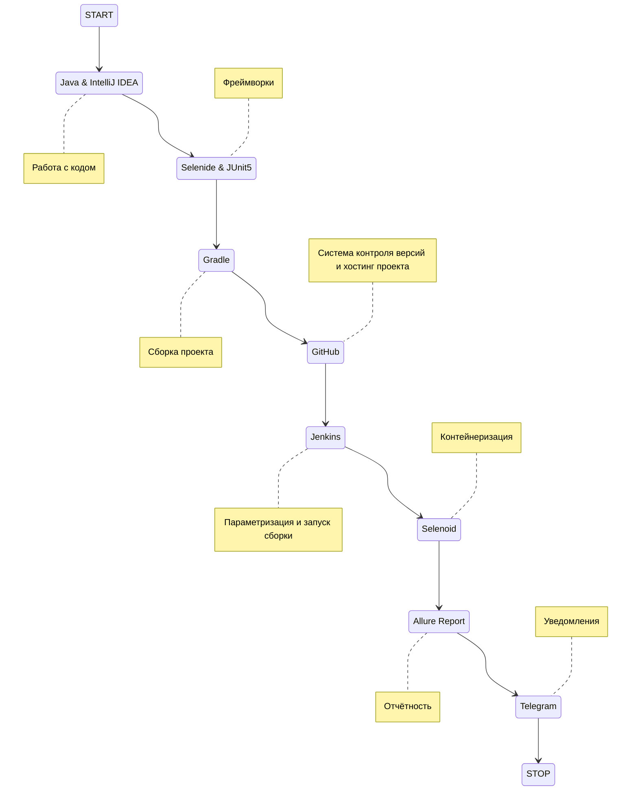
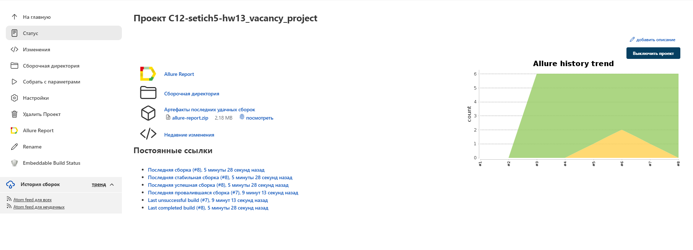
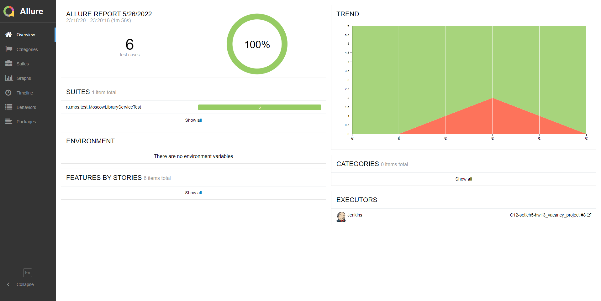
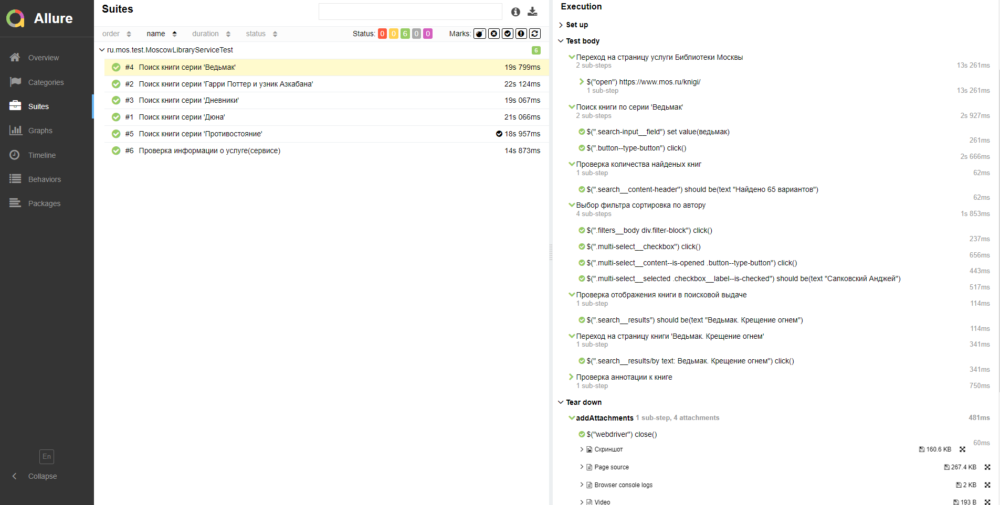
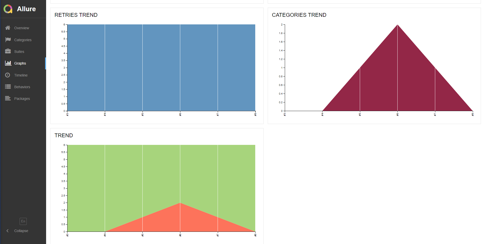
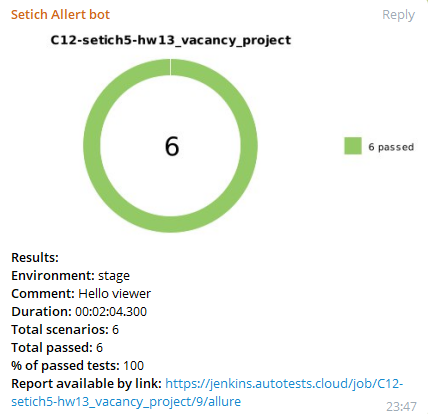
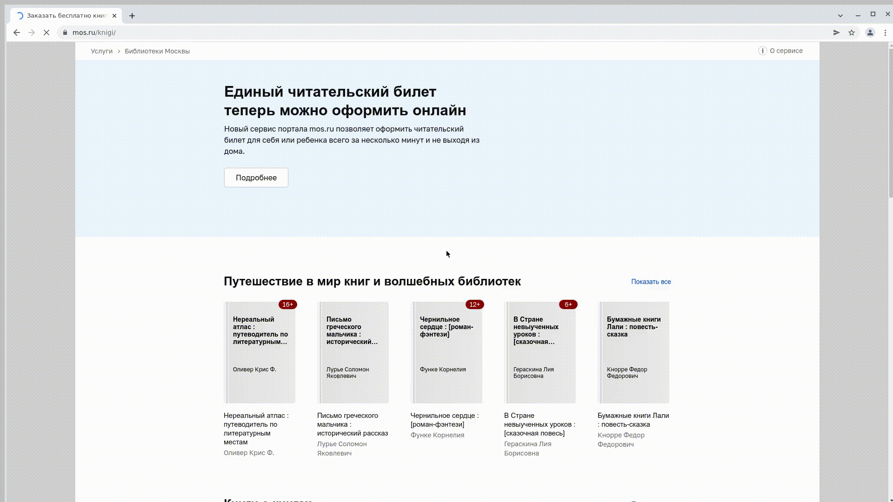

# Автоматизированное тестирование сервиса Библиотеки Москвы сайта mos.ru

## :world_map:    Содержание

➠ [Покрытый функционал](#globe_with_meridians-покрытый-функционал)

➠ [Технологический стек](#computer-технологический-стек)

➠ [Запуск тестов из терминала](#technologist-запуск-тестов-из-терминала)

➠ [Удаленный запуск тестов](#удаленный-запуск-тестов)

➠ [Сборка в Jenkins](#-главная-страница-сборки-Jenkins)

➠ [Отчет о результатах тестирования в Allure Report](#-отчет-о-результатах-тестирования-в-allure-report)

➠ [Уведомления в Telegram с использованием бота](#-уведомления-в-telegram-с-использованием-бота)

➠ [Пример запуска теста в Selenoid](#-пример-запуска-теста-в-selenoid)
## <a name="black_nib-покрытый-функционал"></a>:black_nib: Покрытый функционал

### UI

- [x] Проверка блока информации о сервисе Библиотеки Москвы
- [x] Проверка функциональности поисковой строки
- [x] Проверка фильтрации результатов поиска по автору
- [x] Проверка присутствия книги в поисковой выдаче в соотвествии с поисковым запросом
- [x] Проверка страницы книги
- [x] Проверка аннатации к книге

## :floppy_disk: Технологический стек

<p align="center">


</p>


## :electron: Запуск тестов из терминала

### Локальный запуск тестов

```
gradle clean test
```

### Удаленный запуск тестов

```
clean
test
-DselenoidAddress=${REMOTE_URL}
-DdefaultBrowserSize=${BROWSER_SIZE}
-DdefaultBrowser=${BROWSER}

```

### Параметры сборки

> <code>BROWSER</code> – браузер, в котором будут выполняться тесты (_по умолчанию - <code>chrome</code>_).
>
> <code>BROWSER_SIZE</code> – размер окна браузера, в котором будут выполняться тесты (_по умолчанию - <code>1920x1080</code>_).
>
> <code>REMOTE_URL</code> – адрес selenoid.


##  Главная страница сборки [Jenkins](https://jenkins.autotests.cloud/job/C12-setich5-hw13_vacancy_project/)

<p align="center">
  
</p>

##  Отчет о результатах тестирования в [Allure Report](https://jenkins.autotests.cloud/job/C12-setich5-hw13_vacancy_project/8/allure/)

### :shield: Главная страница Allure-отчета

<p align="center">

</p>

### :shield: Страница с тестами

<p align="center">

</p>

### :shield: Основной дашборд

<p align="center">

</p>

##  Уведомления в Telegram с использованием бота

> После завершения сборки бот, созданный в <code>Telegram</code>, автоматически обрабатывает и отправляет сообщение с отчетом.
<p align="center">

</p>

##  Пример запуска теста в Selenoid

> К каждому тесту в отчете прилагается видео. Одно из таких видео представлено ниже.
<p align="center">
  
</p>